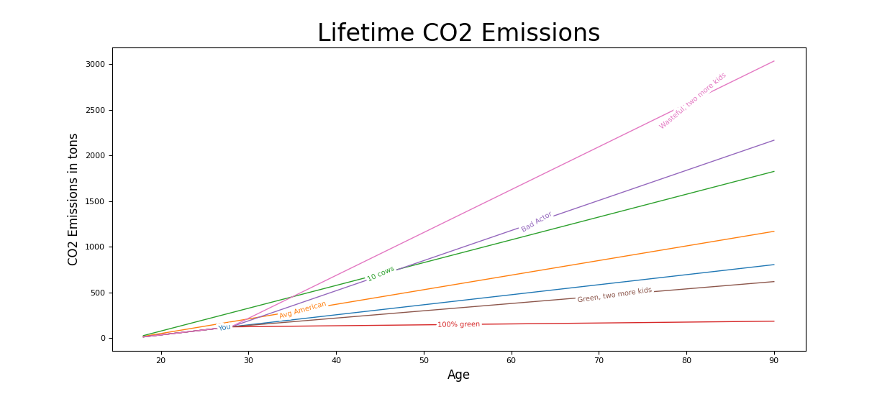

<h1>BeaverHacks2021</h1>

Our contribution for BeaverHacks Fall 2021 shows a user their carbon footprint and how they can improve it over time! 

The user is asked a series of questions to determine their yearly CO2 emissions in lbs.

Our goal is to show a graph with the user's cumulative lifetime footprint over time, along with different trajectories based upon life choices they could make.
<h2>The Goal</h2>

As of Saturday at 6:30pm, we have succeeded at graphing our user lifetime projected footprint and two possible alternative trajectories based on lifestyle changes, along with the average American's lifetime footprint.
<h2>Progress!</h2>

<h2>A Sample Final Graph</h2>

<h2>Sample Usage</h2>

<u><strong>Notes About the Graph</strong></u>

<li>Blue: You. A line generated by the data you provided</li>
<li>Pink: A wasteful person with two extra children, two inefficient cars, lots of utility usage, and no recycling</li>
<li>Purple: A wasteful individual with no kids, two inefficient cars, lots of utility usage, and no recycling</li>
<li>Green: A base emissions case of 10 cows (10 tons per year)</li>
<li>Orange: A base emissions case of the average American (16 tons per year)</li>
<li>Brown: A person who makes green choices but has two extra kids, one moderately efficient car, and does some recycling.</li>
<li>Red: A person who makes 100% green choices. No car, no kids, very minimal utilities, and recycles everything possible.</li>

Matching the red line is not possible in our society, which is what we are aiming to show here.  If you input data is even remotely feasible for your lifestyle, you will not be able to match the red line.
In order to stave off the worst of climate change, everybody has to average 2 tons per year, which is incredibly far off from where we stand today.

<u><strong>Requirements</strong></u>

<li>Python3</li>
<li>matplotlib.pyplot</li>
<li><a href="https://pypi.org/project/matplotlib-label-lines/">Labellines</a></li>

<u><strong>Usage</strong></u>

<li>On your own computer: simply run main.py as you normally would any python script and follow the prompts</li>
<li>Replit: Hit Run!</li>

<strong><u>Citations</u></strong>

All of the data behind our calculations comes from the EPA and can be found <a href="https://www.epa.gov/energy/greenhouse-gases-equivalencies-calculator-calculations-and-references">on their website.</a>

We recommend you check out their EPA's own carbon footprint calculator, which can be found in "data/GHGCalculator.xls"/

<u><strong>To be added</strong></u>

<li><strike>Add sources to this README</strike></li>
<li><strike>Add screenshots of matplotlib.pyplot graphs and general usage</strike></li>
<li>Make presentation video</li>
<li><strike>Convert C02 to tons for more clear data</strike></li>
<li><strike>Add exception handling</strike></li>
<li>Handle a situation where the user's personal line overlaps with a default line. Currently, one just lays on top of the other and hides it.</li>
<li>Add constants that show how much the earth warms if all people expended this much C02, if the graph doesn't become to cluttered (slated for v2)</li>
