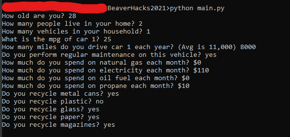

<h1>BeaverHacks2021</h1>

Our contribution for BeaverHacks Fall 2021 shows a user their carbon footprint and how they can improve it over time! 

The user is asked a series of questions to determine their yearly CO2 emissions in lbs.

Our goal is to show a graph with the user's cumulative lifetime footprint over time, along with different trajectories based upon life choices they could make.
The final graph will look something like this:

(images aren't working on replit but are visible on github)

As of Saturday at 6:30pm, we have succeeded at graphing our user lifetime projected footprint and two possible alternative trajectories based on lifestyle changes, along with the average American's lifetime footprint.

Sample Usage:

<u><strong>Requirements</strong></u>

<li>Python3</li>
<li>Plotly</li>
<li>Labellines</li>

<u><strong>Usage</strong></u>

<li>On your own computer: simply run main.py as you normally would any python script and follow the prompts</li>
<li>Replit: Hit Run!</li>

<strong><u>Citations</u></strong>

All of the data behind our calculations comes from the EPA and can be found <a href="https://www.epa.gov/energy/greenhouse-gases-equivalencies-calculator-calculations-and-references">on their website.</a>

We recommend you check out their EPA's own carbon footprint calculator, which can be found in "data/GHGCalculator.xls"/

<u><strong>To be added</strong></u>

<li><strike>Add sources to this README</strike></li>
<li><strike>Add screenshots of plotly graphs and general usage</strike></li>
<li>Make presentation video</li>
<li>Convert C02 to tons for more clear data</li>
<li>Add exception handling</li>
<li>Add constants that show how much the earth warms if all people expended this much C02, if the graph doesn't become to cluttered (slated for v2)</li>
